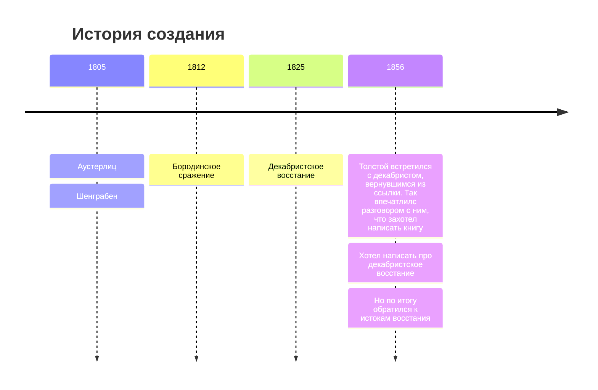
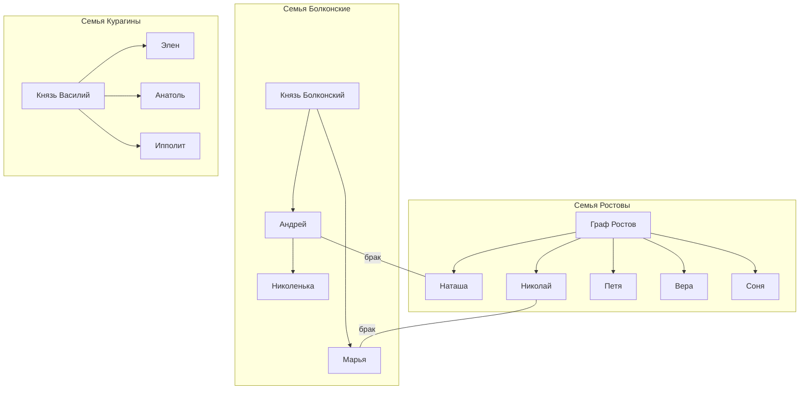

# Лев Николаевич Толстой - "Война и мир"

---

| Годы написания | 1863-1869    |
|----------------|--------------|
| Направление    | Реализм      |
| Род            | Эпос         |
| Жанр           | Роман-эпопея |

Исторический фон + исторические личности.

---

### Персонажи

- Андрей Болконский - умер от смертельного ранения на Бородинском поле;
- Пьер Безухов - член тайного общества;
- Наташа Ростова - самка.

---

В романе эпоха в 15 лет (1805-1820).

---

### Художественное разнообразие

Основной прием - антитеза. Два сражения: Аустерлиц (шахматная партия трех императоров) Бородино (иcтинный патриотизм).

Гуманизм Толстого.

Военачальники. Кутузов и Наполеон.

Истинная (внутренняя) и ложная (Элен Курагина) красота. Истинный (батарея Тушина) и ложный патриотизм. 

---

### Строение

1 том:
- 1805 год
- Шенграбен и Аустерлиц
- Именины Наташи Ростовой
- Болконский уходит на войну
- Пьер становится наследником

---

---

# Конспект по 10 ярким эпизодам романа «Война и мир»

### 1. Салон Анны Павловны Шерер

В начале романа Толстой показывает высшее общество Петербурга. В салоне обсуждают войну с Наполеоном, политику и придворные новости. Люди ведут себя неискренне, стараются казаться лучше. Здесь впервые появляются Андрей Болконский и Пьер Безухов. Автор показывает лицемерие светского общества.

---

### 2. Имение Болконских — Лысые Горы

В семье Болконских царят строгие порядки. Старый князь Болконский отличается суровым характером и дисциплиной. Андрей Болконский перед уходом на войну прощается с женой Лизой. Герой мечтает о славе и хочет совершить подвиг.

---

### 3. Шенграбенское сражение

Во время боя раскрываются настоящие качества людей. Капитан Тушин проявляет смелость и самоотверженность. Николай Ростов впервые сталкивается с ужасами войны и понимает, что война совсем не похожа на красивые рассказы о героизме.

---

### 4. Аустерлицкое сражение

Андрей Болконский мечтает прославиться в бою. Он поднимает знамя и ведёт солдат вперёд, но получает тяжёлое ранение. Лежа на поле, герой смотрит в высокое небо Аустерлица и понимает, насколько мелкими были его мечты о славе. Этот момент становится переломным в его жизни.

---

### 5. Первый бал Наташи Ростовой

Наташа впервые появляется в светском обществе. Она очень волнуется, но её искренность и естественность покоряют окружающих. На балу Андрей Болконский замечает Наташу, и между ними возникают чувства. Эпизод символизирует молодость, счастье и начало любви.

---

### 6. Наташа в театре. Анатоль Курагин

После отъезда Андрея Наташа оказывается под влиянием светской жизни. Анатоль Курагин пытается увлечь её и предлагает бежать вместе. Наташа почти соглашается, совершая ошибку. Этот эпизод показывает её доверчивость и неопытность.

---

### 7. Бородинское сражение

Толстой показывает Бородинскую битву как главное событие войны 1812 года. Русские солдаты проявляют мужество и стойкость. Пьер Безухов находится среди участников боя и видит весь ужас войны. Сражение становится символом силы и единства русского народа.

---

### 8. Совет в Филях

После Бородинского сражения Кутузов собирает военный совет. Он принимает тяжёлое решение оставить Москву ради сохранения армии. Многие генералы не согласны с ним, но Кутузов понимает, что главное — спасти страну и народ. Эпизод раскрывает мудрость полководца.

---

### 9. Пьер в плену. Платон Каратаев

В плену Пьер знакомится с Платоном Каратаевым — простым, добрым солдатом. Каратаев помогает Пьеру понять ценность жизни, душевного спокойствия и любви к людям. Благодаря этому знакомству Пьер духовно меняется.

---

### 10. Смерть Андрея Болконского

После тяжёлого ранения Андрей постепенно умирает. Перед смертью он прощает Наташу и приходит к внутреннему спокойствию. Герой понимает важность любви и прощения. Этот эпизод завершает духовные поиски Андрея Болконского.
