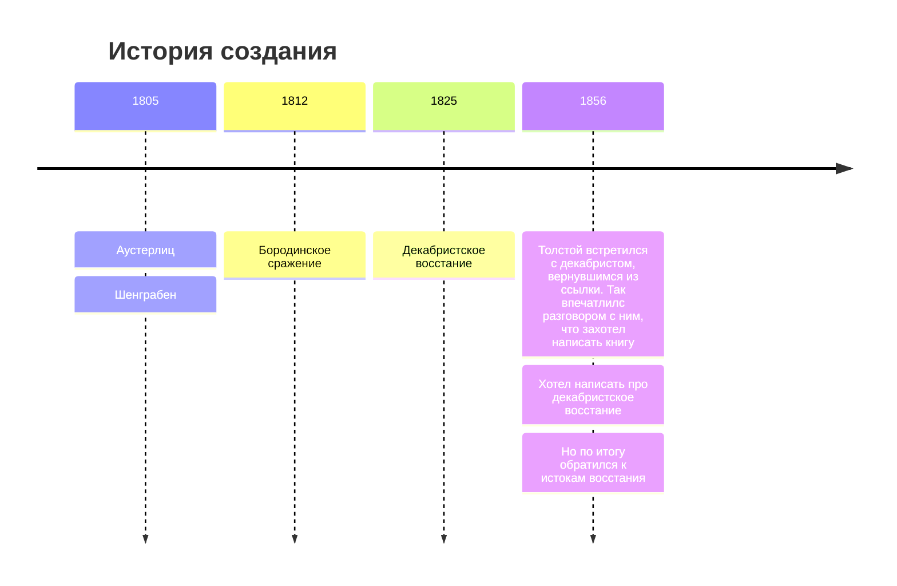

# Лев Николаевич Толстой - "Война и мир"

---

| Годы написания | 1863-1869    |
|----------------|--------------|
| Направление    | Реализм      |
| Род            | Эпос         |
| Жанр           | Роман-эпопея |

Исторический фон + исторические личности.

---

### Персонажи

- Андрей Болконский - умер от смертельного ранения на Бородинском поле;
- Пьер Безухов - член тайного общества;
- Наташа Ростова - самка.

---

В романе эпоха в 15 лет (1805-1820).

---

### Художественное разнообразие

Основной прием - антитеза. Два сражения: Аустерлиц (шахматная партия трех императоров) Бородино (иcтинный патриотизм).

Гуманизм Толстого.

Военачальники. Кутузов и Наполеон.

Истинная (внутренняя) и ложная (Элен Курагина) красота. Истинный (батарея Тушина) и ложный патриотизм. 

---

### Строение

1 том:
- 1805 год
- Шенграбен и Аустерлиц
- Именины Наташи Ростовой
- Болконский уходит на войну
- Пьер становится наследником
- 
