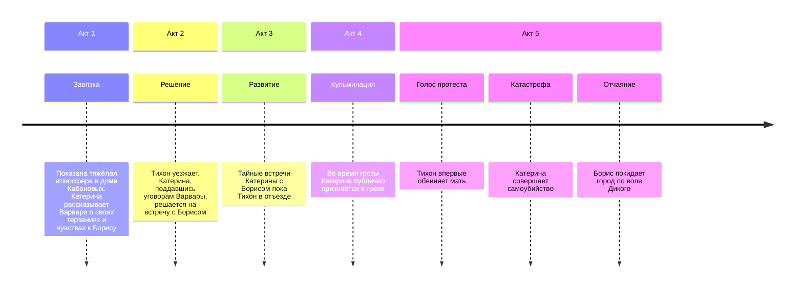
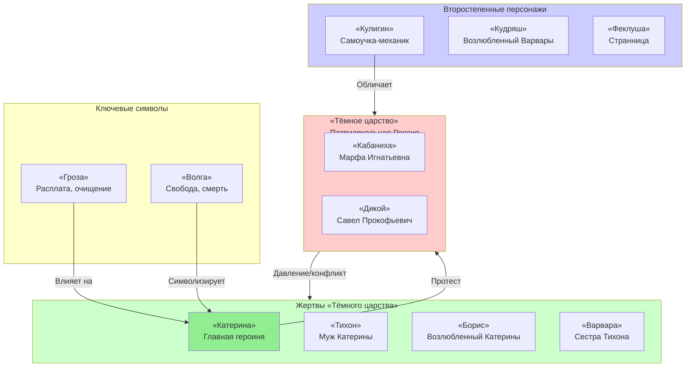

### Сюжет пьесы "Гроза"

```mermaid
timeline
    section Акт 1
        Завязка : Показана тяжёлая атмосфера в доме Кабановых. Катерина рассказывает Варваре о своих терзаниях и чувствах к Борису
    section Акт 2
        Решение : Тихон уезжает. Катерина, поддавшись уговорам Варвары, решается на встречу с Борисом
    section Акт 3
        Развитие : Тайные встречи Катерины с Борисом пока Тихон в отъезде
    section Акт 4
        Кульминация : Во время грозы Катерина публично признаётся в грехе
    section Акт 5
        Голос протеста : Тихон впервые обвиняет мать
        Катастрофа : Катерина совершает самоубийство
        Отчаяние : Борис покидает город по воле Дикого
```

**Ключевой конфликт:** Противостояние свободной личности (Катерина) и патриархального уклада «тёмного царства» (Кабаниха, Дикой).

---

### Система образов

```mermaid
flowchart TD
    subgraph A[«Тёмное царство»<br>Патриархальная Россия]
        direction LR
        A1[«Кабаниха»<br>Марфа Игнатьевна]
        A2[«Дикой»<br>Савел Прокофьевич]
    end

    subgraph B[Жертвы «Тёмного царства»]
        B1[«Катерина»<br>Главная героиня]
        B2[«Тихон»<br>Муж Катерины]
        B3[«Борис»<br>Возлюбленный Катерины]
        B4[«Варвара»<br>Сестра Тихона]
    end

    subgraph C[Второстепенные персонажи]
        direction LR
        C1[«Кулигин»<br>Самоучка-механик]
        C2[«Кудряш»<br>Возлюбленный Варвары]
        C3[«Феклуша»<br>Странница]
    end

    subgraph D[Ключевые символы]
        direction LR
        D1[«Гроза»<br>Расплата, очищение]
        D2[«Волга»<br>Свобода, смерть]
    end

    A -- Давление/конфликт --> B
    B1 -- Протест --> A
    C1 -- Обличает --> A
    D1 -- Влияет на --> B1
    D2 -- Символизирует --> B1
    
    style A fill:#ffcccc
    style B fill:#ccffcc
    style C fill:#ccccff
    style D fill:#ffffcc
    style B1 fill:#90ee90
```
