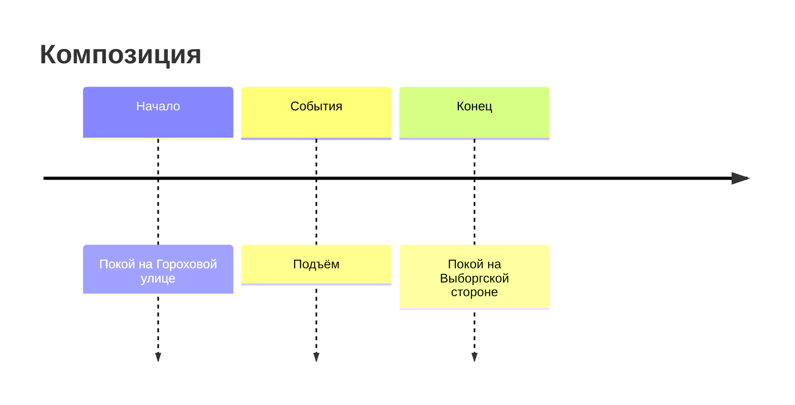

# И.А. Гончаров - "Обломов"

## об авторе

Иван Андреевич Гончаров (1812 - 1891)

- портрет кисти Крамского, висит в Третьяковке
- родился в купеческой семье
- отец - купец, у него был свечной завод; умер, когда сыну было 8 лет
- мать вспоминал, как необыкновенно умную, прозорливую женщину, которая была для него нарвственным авторитетом; она стала прообразом Агафьи Пшенициной
- воспитывал крестный
- учился в комерческом училище, но ушел и стал готовиться к поступлению в Московский университет
- в это же время там учился Лермонтов
- знакомство с Достоевским, Тургеневым, Некрасовым
- юмористическая повесть "Лихая болесть" (бездействие и хандра поглатили Петербург)
- трилогия "Обыкновенная история", "Обломов", "Обрыв"
- в 1848 в журнале "Современник" опубликовали первую главу "Обломова" - "Сон Обломова"
- отправился в кругосветку в составе экспедиции на фрегате "Паллада" - 2 года вел судовой журнал, переводил иностранные документы и составлял летопись похода
- писал письма друзьям и родственникам, из которых сложилось произведение "Фрегат "Паллада"
- ленивый и избалованный, прозвище "Принц де Лень"
- в 1859 выходит "Обломов", которую критики очень хвалили
- критики хвалили писателя, они считали, что главный герой романа - воплощение русского национального характера (аля Емеля или Илья Муромец); правдиво создан образ доброго, но лентвого помещика; правдивое отображение России
- следующее произведение - "Обрыв"
- женат не был; было две истории любви, одна из возлюбленных стала прообразрм Ольги Ильинской
- был критиком

## что такое обломовщина?

- обломовщина - это социальное (общественное) явление, которое зародилось в среде дворян и распространилось на все слои общества (впервые в этой книжке двойником дворянина становится его слуга - крепостной Захар), основными чертами которого являются апатия, лень (ленность), инертность, праздное существование жизни. книга исследует причины зарождения такого социального явления *(причины -> обломовщина -> последствия)*
- причины: воспитание, образование, служба, любовь как служба
- последствия: смерть морали, физическая смерть, деградация в обществе *(человек -> общество -> страна -> цивилизация)*

## почему роман такой объемный?

- описать социальное явление обломовщины, пооказать его причины и его последствия
- автор поднимает философские вопросы: смысл жизни человеческой
- психологические вопросы - быорьба героя с самим собой
- композиция

