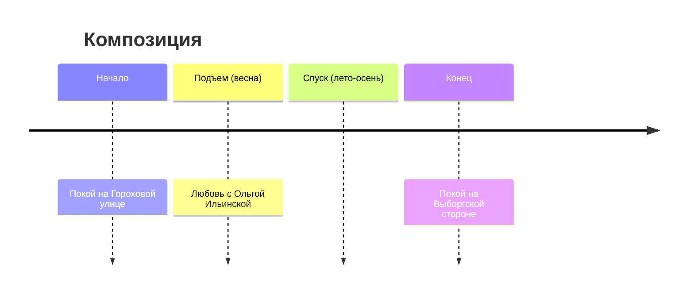
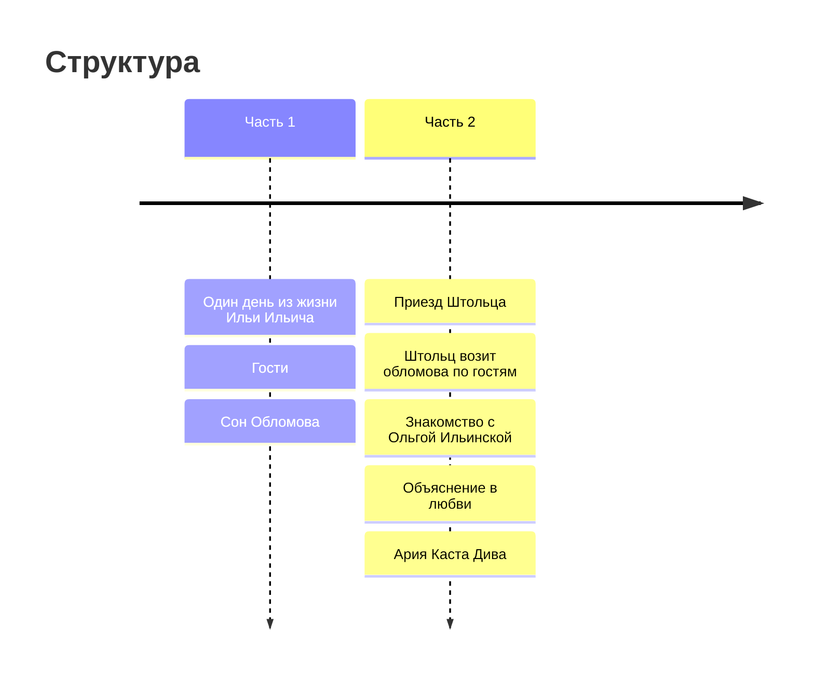

# И.А. Гончаров - "Обломов"

## об авторе

Иван Андреевич Гончаров (1812 - 1891)

- портрет кисти Крамского, висит в Третьяковке
- родился в купеческой семье
- отец - купец, у него был свечной завод; умер, когда сыну было 8 лет
- мать вспоминал, как необыкновенно умную, прозорливую женщину, которая была для него нарвственным авторитетом; она стала прообразом Агафьи Пшенициной
- воспитывал крестный
- учился в комерческом училище, но ушел и стал готовиться к поступлению в Московский университет
- в это же время там учился Лермонтов
- знакомство с Достоевским, Тургеневым, Некрасовым
- юмористическая повесть "Лихая болесть" (бездействие и хандра поглатили Петербург)
- трилогия "Обыкновенная история", "Обломов", "Обрыв"
- в 1848 в журнале "Современник" опубликовали первую главу "Обломова" - "Сон Обломова"
- отправился в кругосветку в составе экспедиции на фрегате "Паллада" - 2 года вел судовой журнал, переводил иностранные документы и составлял летопись похода
- писал письма друзьям и родственникам, из которых сложилось произведение "Фрегат "Паллада"
- ленивый и избалованный, прозвище "Принц де Лень"
- в 1859 выходит "Обломов", которую критики очень хвалили
- критики хвалили писателя, они считали, что главный герой романа - воплощение русского национального характера (аля Емеля или Илья Муромец); правдиво создан образ доброго, но лентвого помещика; правдивое отображение России
- следующее произведение - "Обрыв"
- женат не был; было две истории любви, одна из возлюбленных стала прообразрм Ольги Ильинской
- был критиком

## что такое обломовщина?

- обломовщина - это социальное (общественное) явление, которое зародилось в среде дворян и распространилось на все слои общества (впервые в этой книжке двойником дворянина становится его слуга - крепостной Захар), основными чертами которого являются апатия, лень (ленность), инертность, праздное существование жизни. книга исследует причины зарождения такого социального явления *(причины -> обломовщина -> последствия)*
- причины: воспитание, образование, служба, любовь как служба
- последствия: смерть морали, физическая смерть, деградация в обществе *(человек -> общество -> страна -> цивилизация)*

## почему роман такой объемный?

- описать социальное явление обломовщины, пооказать его причины и его последствия
- автор поднимает философские вопросы: смысл жизни человеческой
- психологические вопросы - быорьба героя с самим собой
- композиция

```mermaid
timeline
    title Композиция
    Начало: Покой на Гороховой улице
    Подъем (весна): Любовь с Ольгой Ильинской
    Спуск (лето-осень)
    Конец: Покой на Выборгской стороне
```

- цикличная структура: зеркальная композиция + ретроспекция
- автор преследует цель погрузить нас в созерцание (Фломандская живопись)

## структура

```mermaid
timeline
    title Структура
    Часть 1: Один день из жизни Ильи Ильича
           : Гости
           : Сон Обломова
    Часть 2: Приезд Штольца
           : Штольц возит обломова по гостям
           : Знакомство с Ольгой Ильинской
           : Объяснение в любви
           : Ария Каста Дива
```

---

## Конспект

### Часть 1 (Все главы)

**Краткий сюжет:**
Экспозиция романа. Мы видим один день из жизни Ильи Ильича Обломова. Он лежит на диване в своей петербургской квартире, носит широкий халат и препирается со слугой Захаром. К нему приходят разные посетители (Волков, Судьбинский, Пенкин, Алексеев, Тарантьев), олицетворяющие светскую суету, карьеру и корысть. Обломов отвергает их предложения поехать развлекаться, считая их жизнь пустой.
У героя проблемы: нужно съезжать с квартиры и разобраться с доходами из имения, но ему лень этим заниматься.
Ключевой момент — **Глава 9 («Сон Обломова»)**. Илья Ильич засыпает и видит свое детство в Обломовке: идиллический мир покоя, обильной еды и отсутствия труда, что объясняет истоки его лени и душевной мягкости.
В конце части приезжает его друг детства — Андрей Штольц.

**Цитаты:**
1.  *«Лежанье у Ильи Ильича не было ни необходимостью, как у больного или как у человека, который хочет спать, ни случайностью, как у того, кто устал, ни наслаждением, как у лентяя: это было его нормальным состоянием».*
2.  *«Началось с неуменья надевать чулки, а кончилось неуменьем жить».*
3.  *«Где же тут человек? Где его целость? Куда он скрылся, как разменялся на всякую мелочь?»* (Обломов о светской жизни).

### Часть 2 (Глава 2, Глава 9)

**Глава 2: Портрет Штольца**
*   **Сюжет:** Автор дает подробную характеристику Андрею Штольцу. Это антипод Обломова: энергичный, трудолюбивый, рациональный, наполовину немец, наполовину русский. Он постоянно в движении и работе. Штольц пытается вытащить Обломова из «болота».
*   **Цитата:** *«Труд — образ, содержание, стихия и цель жизни, по крайней мере моей».* (Штольц).

**Глава 9: Пик отношений с Ольгой**
*   **Сюжет:** Обломов, разбуженный Штольцем, знакомится с Ольгой Ильинской и влюбляется в нее. В 9-й главе происходит сложный психологический момент. Обломов, испугавшись ответственности и считая, что он недостоин любви такой девушки, пишет ей письмо с просьбой расстаться («Мне к лицу покой, хотя скучный, сонный...»). Ольга плачет, читая письмо. В итоге они встречаются, объясняются и понимают, что любят друг друга еще сильнее.
*   **Цитата:** *«Нет, — перебила она, — это нежность... я знаю, вы любите меня: я это видела, я верю вам, а не письму».*

### Часть 4 (Главы 1, 10, 11)

**Глава 1: Жизнь на Выборгской стороне**
*   **Сюжет:** Прошел год после разрыва с Ольгой. Обломов окончательно перебрался на Выборгскую сторону, в дом вдовы Агафьи Матвеевны Пшеницыной. Он снова погрузился в халат и спячку. Пшеницына окружила его заботой, вкусной едой и тишиной, как в Обломовке. Приезжает Штольц, видит деградацию друга, но Обломов отказывается уезжать, признаваясь, что здесь он нашел свой покой. Выясняется, что он женился на Агафье.
*   **Цитата:** *«Я прирос к этой яме больным местом: попробуй оторвать — будет смерть».* (Обломов Штольцу).

**Глава 10: Смерть героя**
*   **Сюжет:** Прошло несколько лет. Штольц снова навещает Обломова, но спасать его поздно. Илья Ильич угас тихо и незаметно, без боли, умерев от апоплексического удара (инсульта). Он оставил после себя сына Андрюшу, которого поручил заботам Штольца. Агафья Матвеевна глубоко скорбит, для нее погас свет жизни.
*   **Цитата:** *«Он скончался без боли, без мучений, как будто остановились часы, которые забыли завести».*

**Глава 11: Эпилог**
*   **Сюжет:** Захар, старый слуга Обломова, опустился, стал нищим и просит милостыню у церкви. Он отказывается ехать в деревню, желая остаться рядом с могилой барина. Штольц и Ольга (которые поженились) взяли на воспитание сына Обломова. Штольц рассказывает литератору историю жизни своего друга, произнося главное слово романа.
*   **Цитата:** *«— А как звали его? — спросил литератор. — Илья Ильич Обломов. — Так это был Обломов? — Погиб, пропал ни за что... — Причина... какая причина! Обломовщина!»*

---

для прочтения:
- ч. 2 г. 4, 5
- ч. 4 г. 11

Конспект

