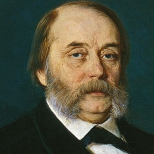
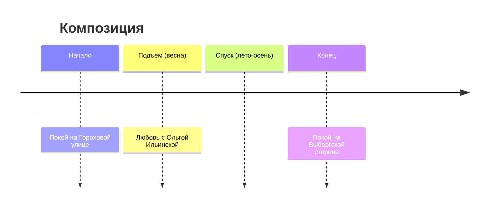
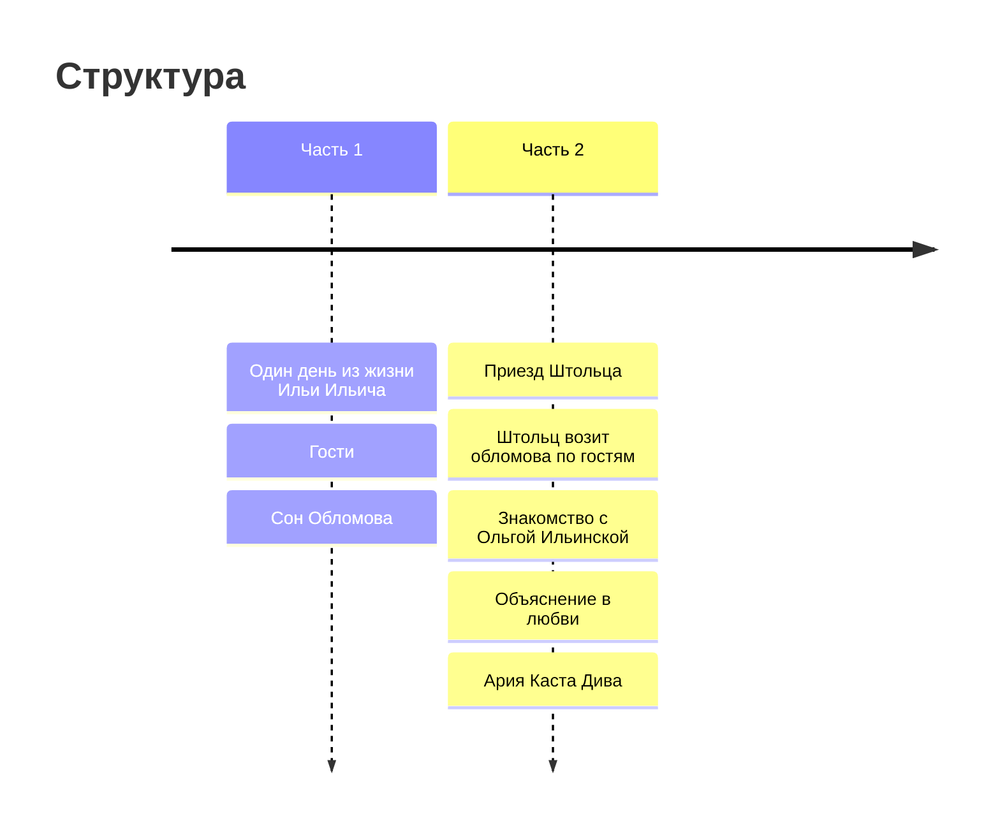

# И.А. Гончаров - "Обломов"

## об авторе

Иван Андреевич Гончаров (1812 - 1891)

- портрет кисти Крамского, висит в Третьяковке
- родился в купеческой семье
- отец - купец, у него был свечной завод; умер, когда сыну было 8 лет
- мать вспоминал, как необыкновенно умную, прозорливую женщину, которая была для него нарвственным авторитетом; она стала прообразом Агафьи Пшенициной
- воспитывал крестный
- учился в комерческом училище, но ушел и стал готовиться к поступлению в Московский университет
- в это же время там учился Лермонтов
- знакомство с Достоевским, Тургеневым, Некрасовым
- юмористическая повесть "Лихая болесть" (бездействие и хандра поглатили Петербург)
- трилогия "Обыкновенная история", "Обломов", "Обрыв"
- в 1848 в журнале "Современник" опубликовали первую главу "Обломова" - "Сон Обломова"
- отправился в кругосветку в составе экспедиции на фрегате "Паллада" - 2 года вел судовой журнал, переводил иностранные документы и составлял летопись похода
- писал письма друзьям и родственникам, из которых сложилось произведение "Фрегат "Паллада"
- ленивый и избалованный, прозвище "Принц де Лень"
- в 1859 выходит "Обломов", которую критики очень хвалили
- критики хвалили писателя, они считали, что главный герой романа - воплощение русского национального характера (аля Емеля или Илья Муромец); правдиво создан образ доброго, но лентвого помещика; правдивое отображение России
- следующее произведение - "Обрыв"
- женат не был; было две истории любви, одна из возлюбленных стала прообразрм Ольги Ильинской
- был критиком

## что такое обломовщина?

- обломовщина - это социальное (общественное) явление, которое зародилось в среде дворян и распространилось на все слои общества (впервые в этой книжке двойником дворянина становится его слуга - крепостной Захар), основными чертами которого являются апатия, лень (ленность), инертность, праздное существование жизни. книга исследует причины зарождения такого социального явления *(причины -> обломовщина -> последствия)*
- причины: воспитание, образование, служба, любовь как служба
- последствия: смерть морали, физическая смерть, деградация в обществе *(человек -> общество -> страна -> цивилизация)*

## почему роман такой объемный?

- описать социальное явление обломовщины, пооказать его причины и его последствия
- автор поднимает философские вопросы: смысл жизни человеческой
- психологические вопросы - быорьба героя с самим собой
- композиция

```mermaid
timeline
    title Композиция
    Начало: Покой на Гороховой улице
    Подъем (весна): Любовь с Ольгой Ильинской
    Спуск (лето-осень)
    Конец: Покой на Выборгской стороне
```

- цикличная структура: зеркальная композиция + ретроспекция
- автор преследует цель погрузить нас в созерцание (Фломандская живопись)

## структура

```mermaid
timeline
    title Структура
    Часть 1: Один день из жизни Ильи Ильича
           : Гости
           : Сон Обломова
    Часть 2: Приезд Штольца
           : Штольц возит обломова по гостям
           : Знакомство с Ольгой Ильинской
           : Объяснение в любви
           : Ария Каста Дива
```

---

## Конспект

### Часть 1 (все главы 1–11) — Краткий сюжет
Илья Ильич Обломов целыми днями лежит на диване в петербургской квартире на Гороховой улице в халате и пыльных туфлях. К нему приходят посетители (Волков, Судьбинский, Пенкин, Тарантьев, Алексеев), но он никого не хочет видеть и никуда не едет. Он пытается написать письмо помещику, но не может. Захар ругается с барином, упрекает в лени, случайно сравнивает с «другими». Обломов оскорбляется и прогоняет Захара. Вечером приходит Штольц — единственный человек, который может вытащить Обломова из спячки (конец части — Штольц увозит его в свет).

Ключевые цитаты (часть 1):
1. «Лежанье у Ильи Ильича не было ни необходимостью, как у больного или как у человека, который хочет спать, ни случайностью, как у того, кто устал, ни наслаждением, как у лентяя: это было его нормальным состоянием».
2. «Где же человек? Где его целость? Куда он исчез, как разменялся на всякую мелочь?»
3. Захар про «других»: «А другие-то как? Другие-то встают, другие-то ездят, другие-то живут!»

### Часть 2, главы 2 и 9
Гл. 2: Штольц знакомит Обломова с Ольгой Ильинской в Летнем саду. Обломов сразу очарован, но боится даже подойти. Штольц буквально толкает его к ней.

Гл. 9: Кульминация любви — сцена «Casta diva». Ольга поёт арию из «Нормы», Обломов в экстазе признаётся ей в любви, она отвечает взаимностью. Они целуются за сиреневой веткой. Это пик счастья Обломова.

Ключевые цитаты:
1. «Я почувствовал жизнь, я ожил… Это вы, Ольга! Вы — моё счастье, вы — цель моей жизни!»
2. Ольга после поцелуя: «Что это? Как это называется?» — Обломов: «Любовь… это любовь!»

### Часть 4, главы 1, 10, 11 — финал
Гл. 1: Прошёл год после разрыва с Ольгой. Обломов живёт на Выборгской стороне у Агафьи Матвеевны Пшеницыной. Он полностью «обломовился»: толстый, вялый, в вечном халате, женился на вдове, родился сын Андрюша.

Гл. 10–11: Приезжает Штольц. Видит полное падение друга. Обломов признаётся: «Я умер давно… Обломовщина меня поглотила». Просит Штольца взять сына после его смерти. Вскоре Обломов умирает от второго апоплексического удара («так же тихо и незаметно, как заснул»). Штольц забирает Андрюшу на воспитание к себе и Ольге.

Ключевые цитаты (часть 4):
1. «Разбитая, обломанная жизнь… Обломовщина!»
2. Последние слова Обломова Штольцу: «Дружба утонула в океане любви… а любовь… утонула в обломовщине».
3. Штольц у могилы: «Илья…» — Захар: «Обломовщина-с…»
